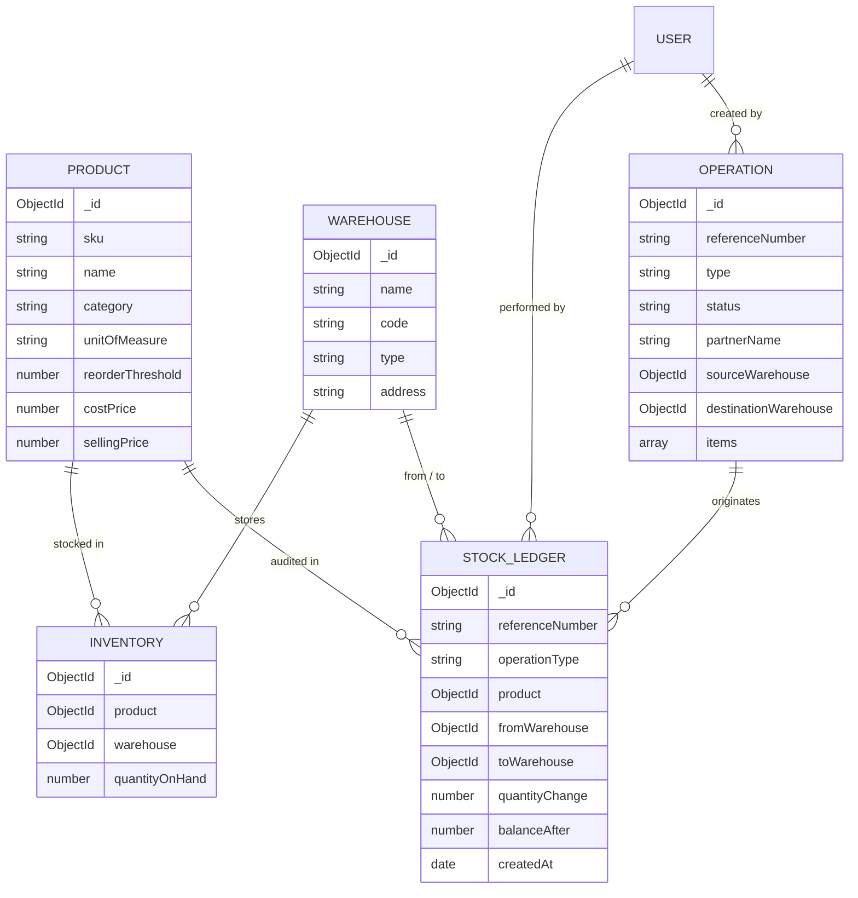

# StockSense — Enterprise Inventory & Warehouse Management System

> Built for the **Odoo x GCET Hyderabad Hackathon 2026**

StockSense is a full-stack, enterprise-grade Inventory Management System (ERP) engineered for real-time stock control, multi-warehouse visibility, automated supply chain workflows, and an immutable movement audit ledger.

---

## ⚡ Tech Stack

- **Frontend**: React 18, Vite, Tailwind CSS, Lucide React, React Router 6, Axios
- **Backend**: Node.js, Express, Mongoose, JWT Authentication, Nodemailer, Morgan
- **Database**: MongoDB (port `27017`) with compound indexes and atomic inventory transactions
- **Architecture**: Separated `frontend/` and `backend/` micro-monorepo

---

## 🚀 Quick Start & Demo Credentials

### Pre-Seeded Demo Accounts:
| Role | Email | Password |
|---|---|---|
| **Administrator** | `admin@stocksense.com` | `Password123!` |
| **Warehouse Lead** | `operator@stocksense.com` | `Password123!` |

### Running the System

#### 1. Backend Server
```bash
cd backend
npm install
npm run seed     # Pre-populates warehouses, products, and sample operations
npm run dev      # Runs Express API on http://localhost:5000
```

#### 2. Frontend Application
```bash
cd frontend
npm install
npm run dev      # Launches Vite UI on http://localhost:5173
```

---

## ✨ Features & Module Breakdown

### 1. Authentication & Session Management
- Sign Up & Sign In with bcrypt password hashing and JWT token management.
- **OTP-Based Password Reset Flow**:
  1. User enters registered email & requests a 6-digit numeric OTP.
  2. Nodemailer dispatches verification code (also pre-filled in development preview for instant testing).
  3. Verifies OTP expiry (10 min lifetime) and resets password.

### 2. Inventory KPI Dashboard
- Real-time KPI Metric Cards:
  - **Total Products in Stock**: Aggregated item quantities across all storage facilities.
  - **Low Stock / Out of Stock Items**: Alert cards highlighting inventory at or below minimum threshold.
  - **Pending Receipts Count**: Incoming goods waiting for dock validation.
  - **Pending Deliveries Count**: Outgoing customer orders awaiting fulfillment.
  - **Internal Transfers Scheduled**: Stock relocations in transit between bays.
- **Dynamic Multi-Dimensional Filters**:
  - Filter by Document Type: Receipts, Delivery Orders, Internal Transfers, Stock Adjustments.
  - Filter by Status: Draft, Waiting, Ready, Done, Canceled.
  - Filter by Warehouse / Location: Main Central, Production Floor, North Logistics Hub.
  - Filter by Product Category: Raw Materials, Furniture, Electronics, Packaging, etc.
  - Full-text search on reference numbers, partner names, and line item SKUs.

### 3. Navigation & Design System
- Modern enterprise left sidebar with collapsible **Operations** dropdown:
  - Dashboard
  - Products Catalog
  - Operations:
    - Receipts (Incoming)
    - Delivery Orders (Outgoing)
    - Internal Transfers
    - Inventory Adjustment
    - Move History
  - Settings (Warehouse Management)
  - User Profile menu with one-click logout
- Color-coded status badges: `Draft` (Slate), `Waiting` (Amber), `Ready` (Blue), `Done` (Emerald), `Canceled` (Rose).

### 4. Product Management
- Track SKU, Name, Category, Unit of Measure (units, kg, liters, meters, boxes, rolls).
- Multi-warehouse stock breakdown displayed per product (`WH-MAIN: 120`, `WH-PROD: 40`).
- Reordering rules with custom minimum threshold alerts.
- Creation, editing, real-time SKU uniqueness validation, and safe deletion prevention.

### 5. Receipts (Incoming Goods)
- Workflow: Create receipt &rarr; Select supplier &rarr; Add product line items & quantities &rarr; Click **"Validate"**.
- System automatically increases stock in destination warehouse and logs `+quantity` entry to central ledger.

### 6. Delivery Orders (Outgoing Goods)
- 4-Stage Fulfillment Workflow:
  1. Create order for customer from source warehouse.
  2. **Pick Items** from storage shelves.
  3. **Pack Items** for dispatch.
  4. **Validate & Ship**: Verifies stock availability, automatically decreases stock in database, and logs `-quantity` movement.

### 7. Internal Transfers
- Move inventory between locations (e.g. `Main Warehouse` &rarr; `Production Floor`, `Rack A` &rarr; `Rack B`).
- Company net stock remains constant; location quantities shift atomically.
- Complete audit trail logged in central ledger.

### 8. Stock Adjustments (Cycle Count Reconciliation)
- Reconciles physical count discrepancies (damage, loss, count errors).
- Auto-fetches current system stock for selected warehouse and calculates delta (`physicalCount - systemCount`).
- Updating physical count automatically applies the delta to inventory and logs adjustment movement.

### 9. Move History (Central Ledger)
- Chronological immutable audit trail of **ALL** movements across all modules.
- Displays Timestamp, Reference #, Movement Type, Product SKU & Name, Source/Destination Locations, Quantity Delta (+/-), UOM, and User.

### 10. Low Stock Alerts & Multi-Warehouse Architecture
- Sticky alert notification banner appears whenever any SKU drops below minimum reorder rules.
- Fast one-click filtering to review understocked items immediately.

---

## 🗄️ Database Model Guidance


